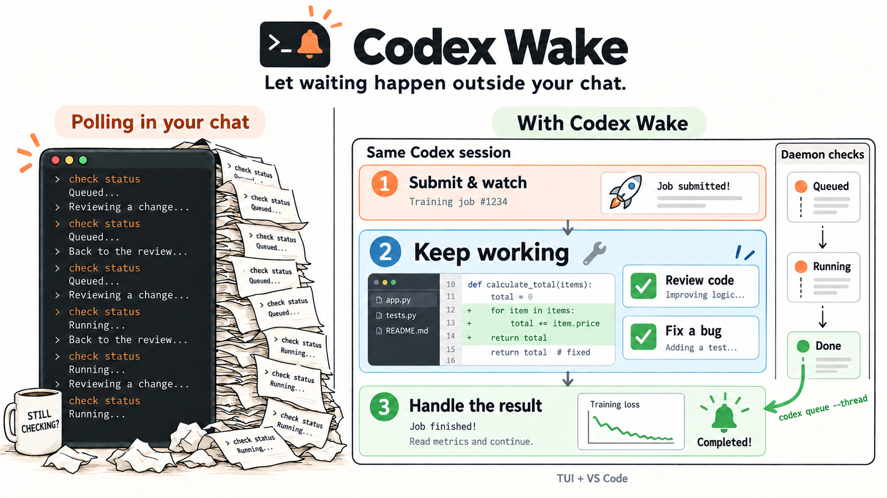

<h1 align="center">Codex Wake</h1>

<p align="center"><strong>告别轮询刷屏与 Token 浪费：长任务后台静默等待，完成后精准唤醒原会话。</strong></p>

<p align="center">
  <a href="https://github.com/Sunt-ing/codex-wake/actions/workflows/tests.yml"></a>
  <a href="LICENSE"></a>
</p>

<p align="center">
  <a href="#开始使用"></a>
  <a href="#命令与参考"></a>
  <a href="README.md"></a>
</p>



Codex Wake 是一个专为 Codex 打造的长任务事件唤醒工具。它将 CI/CD、模型训练、集群作业等长耗时任务的轮询工作移交至后台独立进程；当任务结束时，利用 `codex queue` 将执行结果送回原会话，唤醒 Codex 继续处理。

> **支持环境**：Codex CLI (TUI) 与 VS Code 扩展（**不支持桌面 App**）。

---

## 为什么需要 Codex Wake？

让大语言模型去“主动轮询状态”，本质上是一种**反模式**。

当你让 Codex 提交了一个耗时数小时的集群任务或 GitHub Action，接下来往往会陷入这种困境：

1. **上下文被污染**：Codex 隔几分钟就查一次状态。满屏都是“排队中/运行中”，真正的代码审查、方案讨论和关键结论被淹没在冗长的查询日志中。
2. **白白消耗 Token**：反复查状态，需要模型不断读取查询结果、判断是否继续等待。这些没有新信息的交互也会消耗 token，并往上下文里添加内容。
3. **“伪忙碌”打断注意力**：界面一直显示 Codex 在工作，点开看却只是又查了一次状态。有时它查着查着甚至会“走神”，跑去分析“为什么查询脚本还在等待”，偏离核心工作。

**Codex 的核心算力应当留给思考与编码，而不是卡在死循环里当“人肉定时器”。**

---

## Codex Wake 是怎么做的

整个过程分为三步：

1. **登记任务**：Codex 用原来的工具提交任务后，按内置 skill 指引向后台注册监听（绑定当前会话 ID、指定数据源或状态检查脚本）。注册后，Codex 可以继续处理其他工作。如果没有其他工作，就结束当前回合。
2. **后台负责查询**：独立运行的后台进程（daemon）接管轮询，状态保存在本地 SQLite 中。后台查询不消耗模型 token，也不干扰对话界面。
3. **精准唤醒原会话**：任务结束后，后台进程调用 `codex queue --thread <id> --message <result>` 发送完成消息，精准唤醒发起任务的原会话，Codex 收到后继续获取结果、向下执行。

Codex Wake 通过 Codex 原生的 `queue` 命令把消息送回原会话，并沿用该会话对应的可执行文件和环境配置。结果直接进入原对话，无需猜测哪个是最新聊天、无需模拟键盘输入，也不用另开新 agent 重新交代任务。Codex Wake 自身不托管 App Server。

后台进程重启后，**监听记录和待投递消息可以恢复**。但发起监听的 Codex 进程需要保持运行；如果退出该进程，未投递的监听将被丢弃。崩溃后的投递重试可能产生重复消息，内置 skill 会指导 agent 根据事件 ID 自动识别。

---

## 开始使用

安装前，请确认已有 Python 3.11+，且 Codex 版本支持 `queue` 和 `plugin`。
Codex Wake 适用于 TUI 和 VS Code 的 Codex 扩展，**不支持桌面 App**。
后台服务支持的平台：macOS（launchd）、Linux（systemd）和 Windows 10+。

你可以把下面这段话发给 Codex，让它帮你完成安装：

```text
请按 https://github.com/Sunt-ing/codex-wake 的 README 安装 Codex Wake。
使用长期保留的 Python 环境和我当前的 Codex 安装。
运行 doctor，指导我信任 hooks，并告诉我何时需要新建会话。
确认新会话已登记后，再告诉我可以使用了。
```

也可以用 [uv](https://docs.astral.sh/uv/getting-started/installation/) 自己安装：

```sh
uv tool install git+https://github.com/Sunt-ing/codex-wake.git
codex-wake install
codex-wake doctor
```

如果终端提示找不到命令，请运行 `uv tool update-shell`，然后重新打开终端。
如果你习惯使用 pip，可以在准备长期保留的虚拟环境中运行 `python -m pip install git+https://github.com/Sunt-ing/codex-wake.git`，然后执行相同的 `install` 和 `doctor` 命令。

安装完成后，还需要信任插件的 hooks，并新建一个会话来加载插件：

1. 使用安装时的 `CODEX_HOME` 启动 Codex，在 `/hooks` 中审阅并信任 Codex Wake 的 `SessionStart` 和 `SessionEnd` hooks。VS Code 用户需要让 CLI 使用扩展对应的 `CODEX_HOME`，再完成这一步。
2. **新建 TUI 会话或 VS Code 聊天**，加载 hooks 和 skill。运行 `codex-wake status`，确认新会话已登记。
3. 让 Codex 监听任务。例如：

> $codex-wake 监听 OWNER/REPO 的 GitHub Actions run 123456789。结束后读取结果，如果失败就查日志定位问题。

对于自己集群上的任务，也可以这样告诉 Codex：

> $codex-wake 用我们集群的状态命令监听训练任务 1234，完成后拉取指标并总结结果。

[内置 skill](src/codex_wake/bundled_plugins/codex-wake/skills/codex-wake/SKILL.md) 会指导 Codex 注册监听。接入其他数据源时，可以让 Codex 在项目里编写状态查询脚本，无需修改 Codex Wake。查询 GitHub Actions 时使用 `gh`，查询 GitLab 时使用 `glab`，两者都沿用你已有的登录状态。

---

## 命令与参考

<details>
<summary><strong>监听命令：GitHub、GitLab，以及任何能查状态的任务</strong></summary>

请在需要接收结果的 Codex 会话中运行以下命令。命令默认从 `CODEX_THREAD_ID` 读取目标会话 ID，也可以通过 `--thread` 显式指定。

```sh
codex-wake register github-actions \
  --repository OWNER/REPO --run-id 123456789

codex-wake register gitlab-ci \
  --project GROUP/PROJECT --kind pipeline --id 12345

codex-wake register status-command --subject "training job 1234" -- \
  /absolute/path/to/check-training 1234
```

注册任何类型的监听时，都可以加上 `--message "检查日志，然后继续下一组实验。"`，提前指定唤醒后的处理指令。通过定制指令，可以让 Codex 收到结果后主动行动（例如直接提交 follow-up 任务或分析报错），而不是只回复“好的，看到了”。它会替换默认指令，保留 adapter 返回的任务状态和结果位置。使用 `status-command` 时，把 `--message` 放在 `--` 分隔符之前。不指定时，Wake 会追加默认指令：“If necessary, check the result and decide what to do next.”

GitLab 的 `--kind job` 用于监听单个 job，`--hostname gitlab.example.com` 用于指定其他主机。

状态查询脚本每次运行时只查询一次，并通过退出码告诉 Codex Wake 接下来该怎么处理：

| 退出码 | 含义 |
| --- | --- |
| `75` | 还在排队或运行，之后再查。 |
| `0` | 已结束，stdout 成为完成消息。 |
| 其他 | 本次查询失败，退避重试。 |

如果任务失败或被取消，查询脚本也应返回 `0`，并在输出中说明任务结果，因为这两种情况都表示任务已经结束。脚本应在 10 秒内完成查询，命令中的文件路径应使用绝对路径。后台进程以你的权限运行，但不会沿用项目的工作目录。

不同任务使用不同的 subject。同一会话中重复注册相同 source 和 subject 时，只有命令、配置和自定义消息都一致，才会返回已有监听；任一项不同都会报冲突。

</details>

<details>
<summary><strong>自定义 adapter 协议</strong></summary>

如果集成需要结构化输入，可以编写自定义 adapter。每次查询时，Codex Wake 会通过 stdin 向 adapter 传入一个 JSON 对象：

```json
{
  "protocol_version": 1,
  "registration_id": "...",
  "source": "example",
  "subject": "task-42",
  "config": {"task_id": "42"}
}
```

adapter 应向 stdout 输出一个 JSON 对象。任务尚未结束时，返回：

```json
{"state": "pending"}
```

任务结束时返回：

```json
{
  "state": "terminal",
  "event_id": "example:REGISTRATION_ID:completed",
  "message": "CODEX_WAKE example:REGISTRATION_ID:completed\ntask-42 completed successfully"
}
```

把 `REGISTRATION_ID` 替换为请求中的注册 ID。事件 ID 必须稳定，在整个状态数据库中唯一。如果事件 ID 发生冲突，Codex Wake 会为对应监听记录错误，并在退避后重试，其他消息仍会继续投递。消息正文中也应包含事件 ID，方便接收消息的 agent 识别重复投递。

```sh
codex-wake register custom \
  --source example --subject task-42 \
  --command-json '["python", "/absolute/path/to/adapter.py"]' \
  --config-json '{"task_id": "42"}'
```

adapter 每次运行只负责查询一次。后续的查询调度、超时处理、状态保存和投递重试都由 Codex Wake 负责。

</details>

<details>
<summary><strong>安装配置、排障与卸载</strong></summary>

`install` 会创建用户级后台服务，并把管理会话生命周期的插件安装到当前 `CODEX_HOME`。如果要使用另一套 Codex，可以显式指定相关路径：

```sh
codex-wake install \
  --codex-bin /path/to/codex \
  --codex-home /path/to/codex-home \
  --sqlite-home /path/to/sqlite-home
```

请保留安装时使用的 Python 环境，因为后台服务和 hooks 都需要通过其中的 Python 可执行文件运行。安装插件后，你仍需要审阅并信任 hooks；如果后续更新修改了 hook 定义，也需要重新审阅。参见 [Codex 的 hook 信任机制](https://learn.chatgpt.com/docs/hooks#review-and-trust-hooks)。

在 macOS 上，请使用当前已登录桌面的用户安装。后台服务运行在 launchd 的 `gui/<uid>` 域中，并使用安装时保存的 PATH。如果修改了 PATH，需要重新安装后台服务，以便它能找到 Homebrew 和用户目录中的命令。

macOS 默认状态目录为 `~/Library/Application Support/codex-wake`，其中的 `daemon.stderr.log` 和 `daemon.stdout.log` 保存日志。把 `--state-dir` 放在子命令之前，可以指定其他状态目录。

```sh
codex-wake doctor
codex-wake --json status
codex-wake --json events --limit 20
# macOS 服务详情
launchctl print gui/$(id -u)/com.sunting.codex-wake
# 移除插件和用户级服务
codex-wake uninstall
```

排障时，除了确认后台服务运行正常，还需要确认当前会话已经登记；服务正常并不能说明会话的 hooks 已经执行。事件状态为 `delivered` 时，表示 queue 已接受消息，不代表模型已经处理完这条消息。

Codex Wake 的 Python 运行代码只依赖标准库，查询数据源时使用 `gh`、`glab` 已有的登录状态。任务如何提交、何时更新 Codex，仍由你决定。

</details>

<details>
<summary><strong>开发与测试覆盖</strong></summary>

```sh
python -m pip install '.[test]' ruff==0.16.6 build
ruff check src tests
ruff format --check src tests
python -m unittest discover -s tests -v
python -m build
```

CI 在 Linux、Windows、Apple Silicon macOS 和 Intel macOS 上运行 Python 3.11/3.14 测试。两种 Mac 架构都测试真实 launchd 的启动、重装、崩溃恢复、回滚、投递和卸载。

如果要运行完整集成测试，需要先登录 macOS 桌面，并确保本机有兼容的 Codex 可执行文件：

```sh
CODEX_WAKE_MACOS_E2E=1 CODEX_WAKE_CODEX_E2E=1 \
  python -m unittest discover -s tests -v
```

测试会创建独立服务、临时状态目录和 Codex home，由本地 fixture 提供模拟的模型响应。验收范围包括插件安装与更新、生命周期 hooks，以及向两个活跃会话中的指定会话投递消息。目标会话空闲或正在处理另一回合时的投递，以及真实 PTY 中的唤醒消息，都有测试覆盖。测试不会调用远程模型，也不会修改现有 Codex 会话。

2026-09-09 的 VS Code 人工验收使用扩展 `26.903.61454`、Codex `0.153.4`，环境为 Apple Silicon macOS 26.5：原聊天显示了唤醒消息，并完成下一回合。如需复现，可以使用 `tests/macos_surface_fixture.py` 提供测试环境，在临时的 VS Code profile 中选择它生成的 wrapper。测试结束后，请关闭测试窗口并停止 fixture。

目前尚未实测 macOS 注销后重新登录或睡眠恢复的情况；暂停或重启 daemon 的测试不能替代这两项验收。
桌面 App 不在支持范围内。

</details>

[MIT](LICENSE) © 2026 Sunt-ing
